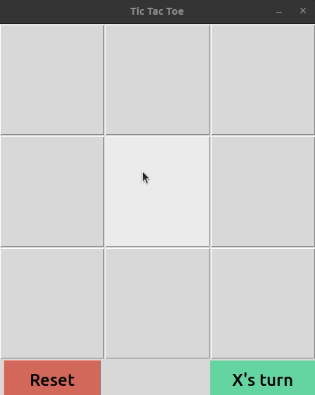

# Simple Artificial Intelligence Games
This repository consists of three simple games which are using artificial intelligence search algorithms:

[1. Maze Problem using A* Algorithm](#1-maze-problem-using-a-algorithm)</br>
[2. N-Queens using Simulated Annealing Algorithm](#2-n-queens-using-simulated-annealing-algorithm)</br>
[3. Tic-Tac-Toe using Alpha-Beta pruning algorithm](#3-tic-tac-toe-using-alpha-beta-pruning-algorithm)</br>


## 1. Maze Problem using A* Algorithm
The [maze solver script](/MazeProblem/maze.py) using A* algorithm which is an informed search algorithm and it utilizes [Manhattan distance](https://en.wikipedia.org/wiki/Taxicab_geometry) as its heuristic for finding the optimal path from the start state of the maze to its goal state.

### How to Specify Mazes?
As you can see in the following figure, each tile is made of a 4-bit binary number.


Thus, each tile in the maze has a corresponding 4-bit number, from 0 to 15. See the conversion table(also, you can see it [here](https://docs.google.com/spreadsheets/d/1y7KYhUlC1OGaRbedLOUE6w6e3GAonbb-MzpsPF31jK8/edit?usp=sharing)):


The text file should have the following sections respectively:
1. Dimension of the maze. ```n m``` specifies a maze with ```n``` rows and ```m``` columns.
2. Indexes of the start state. ```i j```
3. Indexes of the goal state. ```i j```
4. A matrix consists of ```n``` rows and ```m``` decimal numbers based on the conversion table.

#### Example
The following maze is modified using the conversion table:


### How to Run Code?
First of all, make sure of installing python. Second, install *matplotlib* using the following command.

```pip3 install matplotlib```

For running the program use the following command while you are in *maze.py* directory

```python3 maze.py path-to-map.txt [path-to-other-map(s).txt]```

### How to Find Out Solution?
As you run the script, it will print the action sequence from the start state to the goal in the terminal. You can see the previous example's solution:
```Actions of map.txt: ['DOWN', 'DOWN', 'DOWN', 'DOWN', 'DOWN', 'RIGHT', 'DOWN', 'RIGHT', 'RIGHT', 'RIGHT', 'UP', 'RIGHT', 'UP', 'RIGHT', 'RIGHT', 'DOWN', 'DOWN', 'RIGHT', 'DOWN', 'DOWN', 'DOWN', 'RIGHT', 'UP', 'UP']```

Also, you can see the visual form of steps in the corresponding ```.png```(s) file which is created in the same directory. The figure below is the image of the example's solution:


## 2. N-Queens using Simulated Annealing Algorithm
This [python script](/NQueens/nqueens.py) uses simulated annealing which is a well-known local search algorithm. In metallurgy, annealing is the process used to temper or harden metals and glass by heating them to a high temperature and then gradually cooling them, thus allowing the material to reach a low energy crystalline state. This algorithm considers a similar strategy for optimization the heuristic.
This code considers **non-checking queen pairs** as its heuristic and tries to find the global maximum for it.

### How to Input State of Queens?
For ease of processing, it assumes each column contains exactly one queen.
A text file with the following sections for running the program is necessary:
1. First line defines ```n``` that is the number of queens.
2. Second line contains of n numbers in **[0,n-1]** interval that determine the row's index of each queen.

### Example
A file with the following content specifies an 8x8 chessboard. The number of each queen's row are written respectively.

```
8
0 1 2 3 4 5 6 7
```

The corresponding state of queens are:

```
♛  -  -  -  -  -  -  -  
-  ♛  -  -  -  -  -  -  
-  -  ♛  -  -  -  -  -  
-  -  -  ♛  -  -  -  -  
-  -  -  -  ♛  -  -  -  
-  -  -  -  -  ♛  -  -  
-  -  -  -  -  -  ♛  -  
-  -  -  -  -  -  -  ♛
```

### How to Run Code?
The only requirement for running this code is installing python.
The following command runs the program:

```python3 nqueens.py path-to-problem.txt [no-of-steps]```

The first argument is the address of the mentioned file. And the second argument which is optional is the number of steps that the algorithm has to take. The default value of steps is 1000.

## Where Is the Suggested Solution?
After running completely, you will find the final suggested solution in the format below:

```
Solution is [[2, 0], [7, 1], [5, 2], [1, 3], [3, 4], [6, 5], [0, 6], [2, 7]]  with h = 26 from 28
-  -  -  -  -  -  ♛  -  
-  -  -  ♛  -  -  -  -  
♛  -  -  -  -  -  -  ♛  
-  -  -  -  ♛  -  -  -  
-  -  -  -  -  -  -  -  
-  -  ♛  -  -  -  -  -  
-  -  -  -  -  ♛  -  -  
-  ♛  -  -  -  -  -  -
```
You can find the indexes of queens in the first line. Also, the number of non-checking queen pairs of the suggested state is mentioned. And you can see the visual form of the queens, but this is *not* the only output of the algorithm. There is a **log file** in the same directory, you can see all of the steps with their pieces of information there.


## 3. Tic-Tac-Toe using Alpha-Beta Pruning Algorithm
Tic-Tac-Toe or X O game is a simple game with a perfect deterministic search tree. The Alpha-Beta pruning algorithm tries to prune unuseful branches in order to optimize time and space complexity.

### Requirments
The visual interface of this project is based on [Tkinter](https://docs.python.org/3/library/tkinter.html) so installing this module is necessary.

### How to Run Code?
Go to the directory of ```tic-tac-toe.py``` which is [here](./Tic-Tac-Toe) and simply run the following command:
```
python3 tic-tac-toe.py
```
### The result

The visual interface is available here:




## Credits
This project is a part of *Artificial Intelligence and Expert System* course of *Kharazmi University*.</br>The [icons](./Tic-Tac-Toe/images) are provided from [Icon8](https://icons8.com/).
